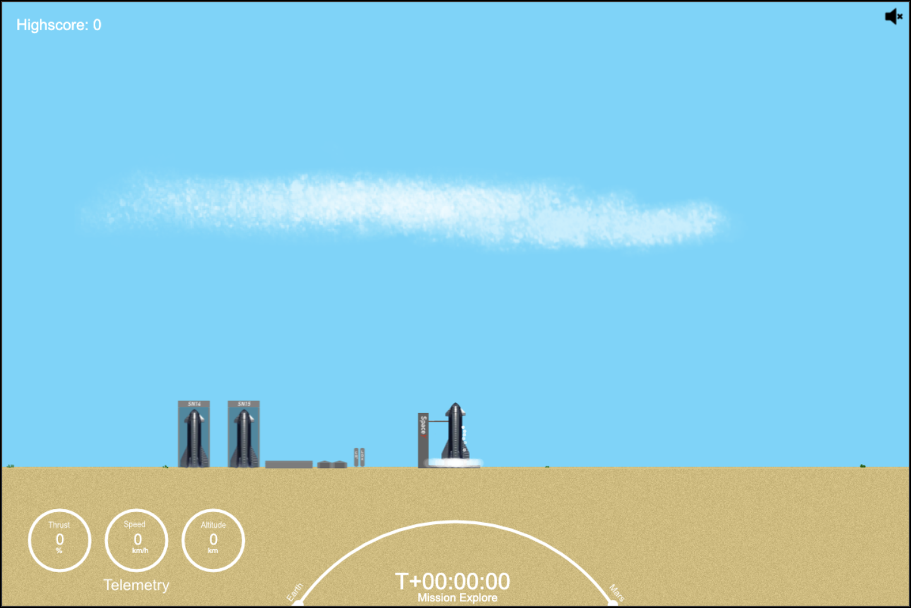
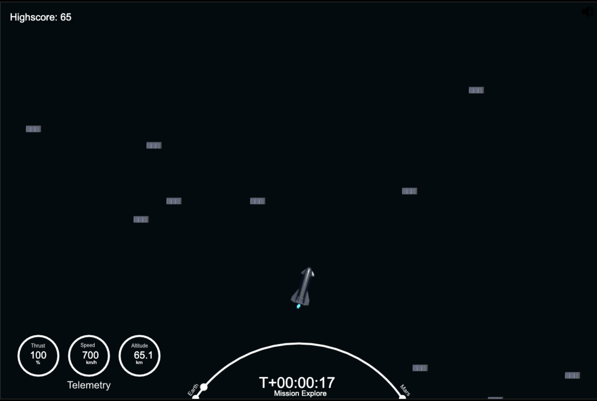

# mars_2024
a small HTML5 game where you try to reach mars with one of the starships (there are many to your disposal)

Key features:
- sound
- particle effects
- dynamic weather
- deathscreen
- infinite, dynamically generated world
- eastereggs

This was created during one of my semester breaks and it has very messy (and probably buggy) code.  
Every semester break I try to take a look at a different area of computer science.  
This one obviously belongs to "game development".

There are a few Elon-related eastereggs to be found - if you pay attention you might catch a glimpse of a SR-71 or a boring machine.

  
   

### Implementation

I used the [Phaser 3](https://phaser.io/phaser3) library.
  This is a good start for anyone who's interested: [lesscake.com](https://www.lesscake.com/phaser-game-tutorial)

